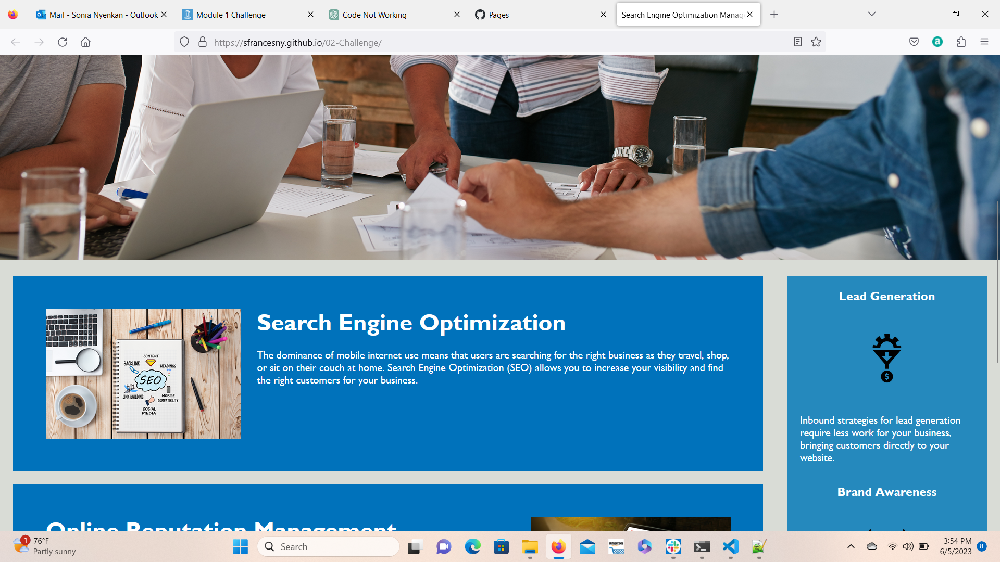
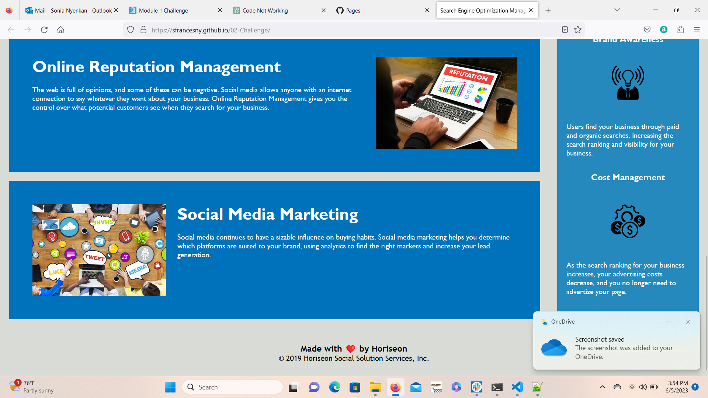

# 02-Challenge
<!-- On-the-job ticket or feature request Challenges -->

## Description 
The goal of refactoring this particular code as a developer is to improve the intended software through semantic HTML elements, proper treatment of CSS selectors, alwhile following accessibility standards for viewers.

## User Story

```
AS A marketing agency
I WANT a codebase that follows accessibility standards
SO THAT our own site is optimized for search engines
```

## Acceptance Criteria

```
GIVEN a webpage meets accessibility standards
WHEN I view the source code
THEN I find semantic HTML elements
WHEN I view the structure of the HTML elements
THEN I find that the elements follow a logical structure independent of styling and positioning
WHEN I view the icon and image elements
THEN I find accessible alt attributes
WHEN I view the heading attributes
THEN they fall in sequential order
WHEN I view the title element
THEN I find a concise, descriptive title
```
## Usage 
This following website intends to spread knowledge on the listed topics: search engine optimization, management of your online reputation, and the advantages of social media marketing. The importance of accessiblity is highlighted within refactored code.  

 ## Screenshots

 
 

Link: https://sfrancesny.github.io/02-Challenge/
